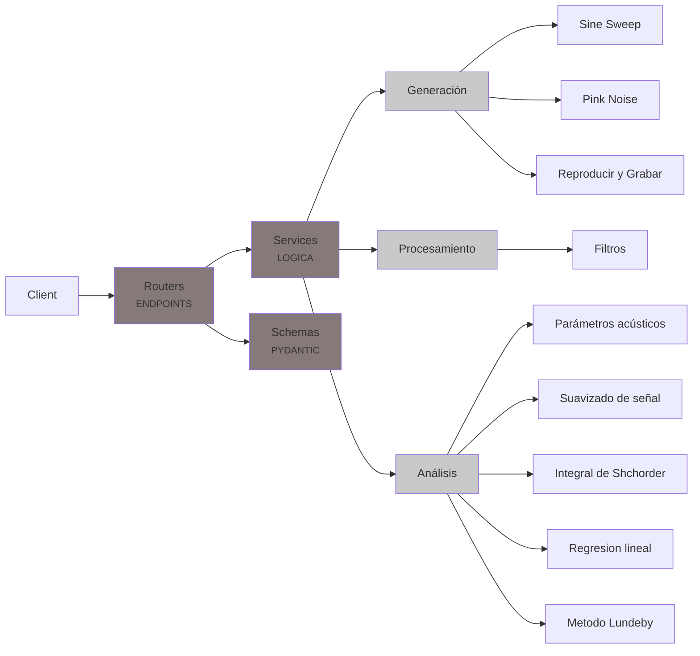

# RIR-API

API REST para procesamiento y analisis de respuestas al impulso segun la norma ISO 3382.

<!-- Badges -->


## Descripcion

RIR-API es un proyecto educativo que implementa una API REST (FastAPI) con una cadena
completa de procesamiento acustico: generacion de senales de excitacion, procesamiento
de respuestas al impulso por bandas de octava y calculo de parametros acusticos
(EDT, T20, T30) segun la norma [ISO 3382](https://www.iso.org/obp/ui/en/#iso:std:iso:3382:-1:ed-1:v1:en).

> **API de referencia**: Explorar la [documentacion interactiva de la API de la catedra](https://rir-api.onrender.com/docs) para entender la estructura de endpoints, schemas y respuestas esperadas.

## Integrantes del grupo
 
  Dulcinea Bonet | Legajo: 81506. $${\color{magenta}Responsable \space de \space testing/CI}$$.

  Valentina De Piero | Legajo: 72221. $${\color{yellow}Responsable \space de \space procesamiento}$$.

  Federico Gionco | Legajo: 56901. $${\color{lightblue}Responsable \space de \space generacion \space de  \space senales}$$.

  Eugenia Onnainty | Legajo: 74462. $${\color{green}Responsable \space de \space documentacion}$$.

## Requisitos previos

- Python 3.12 o superior
- [uv](https://docs.astral.sh/uv/) (gestor de paquetes y entornos virtuales)

## Instalacion

```bash
# Clonar el repositorio
git clone https://github.com/valentinadepiero/trabajo-practico-ss.git
cd trabajo-practico-ss

# Crear entorno virtual e instalar dependencias
uv venv
uv pip install -e ".[dev]"
```

## Ejecucion

```bash
# Iniciar la API con hot-reload
uvicorn app.main:app --reload

# O usando el modulo directamente
python -m app.main
```

La API estara disponible en `http://localhost:8000`. Documentacion interactiva en:
- Swagger UI: `http://localhost:8000/docs`
- ReDoc: `http://localhost:8000/redoc`
## Diagrama de estructura


## Estructura del proyecto

```
rir-api/
├── app/
│   ├── __init__.py
│   ├── main.py                    # Punto de entrada FastAPI
│   ├── routers/
│   │   ├── health.py              # GET /health
│   │   ├── signals.py             # Endpoints de generacion (M1 → M3)
│   │   ├── filters.py             # Endpoints de filtrado (M2 → M3)
│   │   ├── acoustics.py           # Endpoints de analisis (M3)
│   │   └── utils.py               # Endpoints de utilidades (M3)
│   ├── schemas/
│   │   └── ...                    # Modelos Pydantic de request/response
│   └── services/
│       ├── pink_noise.py          # Generacion de ruido rosa (M1)
│       ├── sine_sweep.py          # Generacion de sine sweep (M1)
│       ├── signal_utils.py        # Utilidades de procesamiento (M2)
│       ├── filter.py              # Filtros de banda de octava (M2)
│       └── acoustic_parameters.py # Parametros acusticos ISO 3382 (M3)
├── tests/
│   ├── test_generacion.py         # Tests de generacion (M1)
│   ├── test_procesamiento.py      # Tests de procesamiento (M2)
│   ├── test_analisis.py           # Tests de analisis (M3)
│   └── test_api.py                # Tests de endpoints (M3)
├── docs/                          # Documentacion
├── .github/workflows/ci.yml       # Integracion continua
├── pyproject.toml                 # Configuracion del proyecto
└── README.md
```

## Milestones

### M0 — Setup del entorno | Arquitectura (El plano) 
**Fecha:** Semana 5 (28 de abril de 2026)

- [ ] Hacer fork del repositorio template.
- [ ] Clonar el fork y verificar que el entorno se instala correctamente.
- [ ] Ejecutar la API: `uvicorn app.main:app --reload`.
- [ ] Verificar que `/health` responde correctamente.
- [ ] Ejecutar los tests (todos deben fallar con `NotImplementedError` excepto los de API).
- [ ] Verificar que el CI funciona en GitHub Actions.

### M1 — Generacion de senales
**Fecha:** Semana 8 (19 de mayo de 2026)

- [ ] Implementar `generar_ruido_rosa()` en `app/services/pink_noise.py`.
- [ ] Implementar `generar_sine_sweep()` en `app/services/sine_sweep.py`.
- [ ] Implementar `reproducir_y_grabar()`.
- [ ] Todos los tests de `test_generacion.py` deben pasar.

### M2 — Procesamiento de senales (RI)
**Fecha:** Semana 12 (16 de junio de 2026)

- [ ] Implementar `cargar_audio()` en `app/services/signal_utils.py`.
- [ ] Implementar `obtener_ri_desde_sweep()` en `app/services/signal_utils.py`.
- [ ] Implementar `filtro_octava()` en `app/services/filter.py`.
- [ ] Implementar `a_escala_log()` en `app/services/signal_utils.py`.
- [ ] Implementar `sintetizar_ri()` para validacion.
- [ ] Todos los tests de `test_procesamiento.py` deben pasar.

### M3 — API REST y analisis de parametros acusticos (Producto Final)
**Fecha:** Semana 15 (7 de Julio de 2026)

- [ ] Implementar `integral_schroeder()` en `app/services/acoustic_parameters.py`.
- [ ] Implementar `regresion_lineal()` en `app/services/acoustic_parameters.py`.
- [ ] Implementar `calcular_parametros_acusticos()` en `app/services/acoustic_parameters.py`.
- [ ] Crear routers y schemas para exponer toda la funcionalidad como API REST.
- [ ] Todos los tests de `test_analisis.py` y `test_api.py` deben pasar.
- [ ] (Opcional) Implementar `metodo_lundeby()`.

## Como correr los tests

```bash
# Ejecutar todos los tests
uv run pytest -v

# Ejecutar tests de un modulo especifico
uv run pytest tests/test_generacion.py -v

# Ejecutar tests de la API
uv run pytest tests/test_api.py -v

# Ejecutar tests con reporte de cobertura
uv run pytest --tb=short
```

## Como correr el linter

```bash
# Verificar estilo de codigo
uv run ruff check app/ tests/

# Corregir automaticamente lo que se pueda
uv run ruff check --fix app/ tests/

# Formatear el codigo
uv run ruff format app/ tests/
```

## Licencia

Este proyecto esta licenciado bajo la Licencia MIT. Ver el archivo `LICENSE` para mas detalles.
